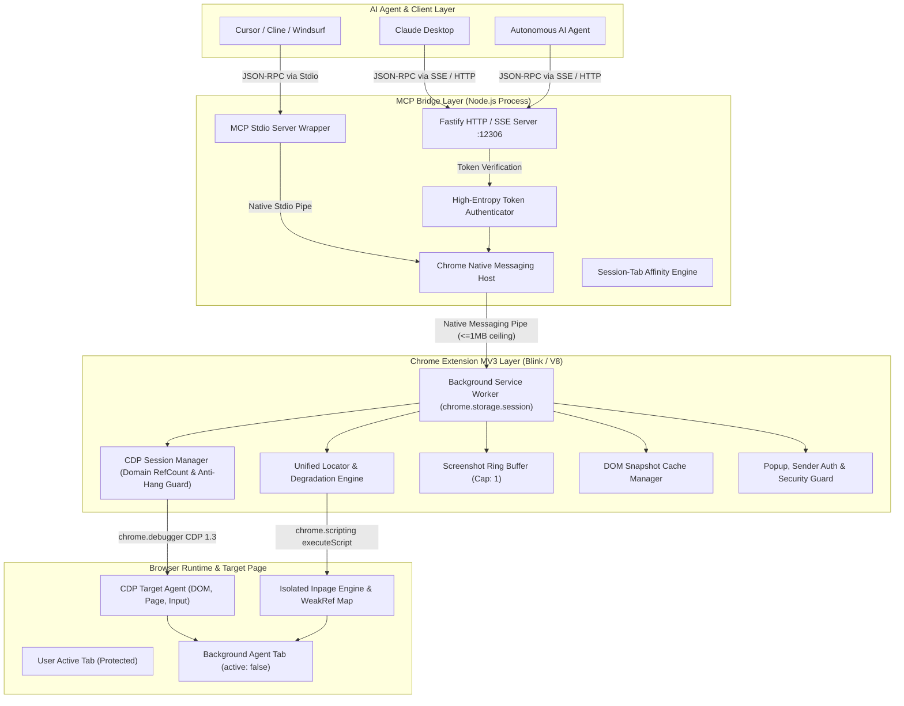
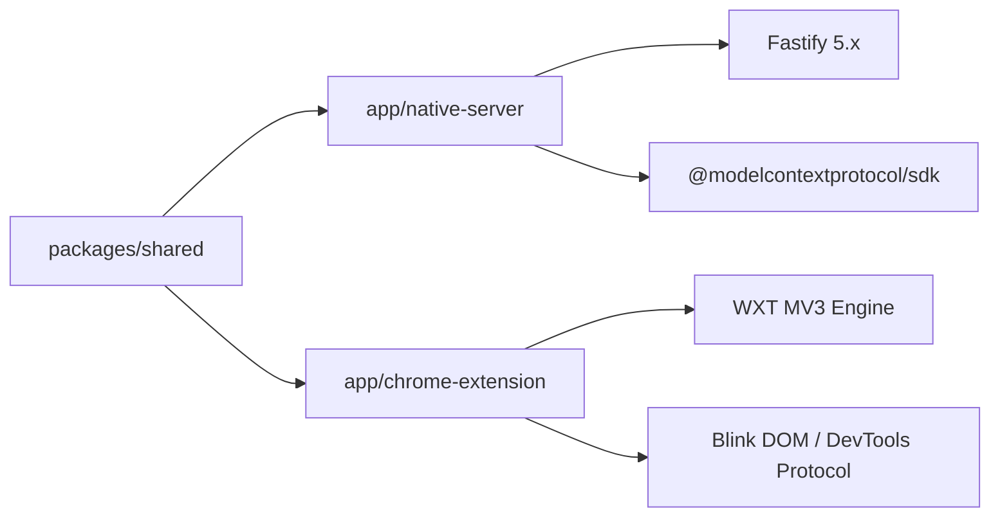
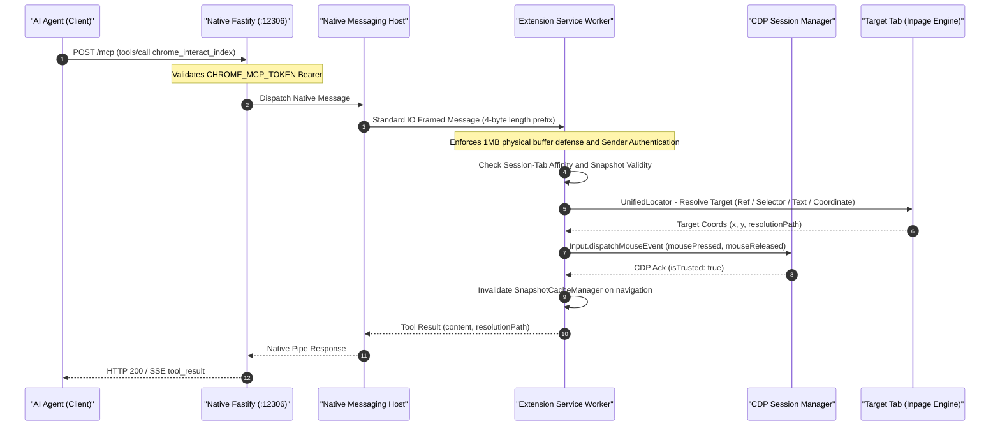
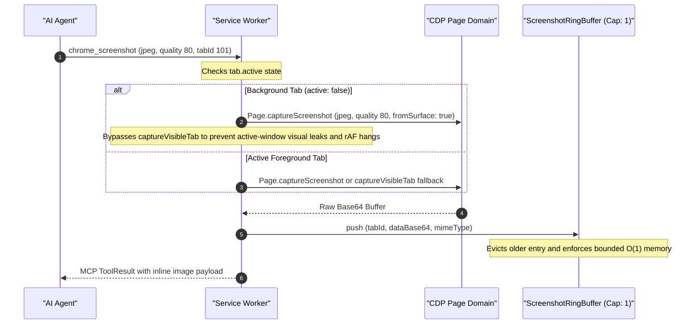

# BrowserPaw (mcp-chrome) Architecture & System Design 🏗️

> **Version**: 3.2.0 (Production Stable Release)  
> **Target Runtime**: Chrome Extension Manifest V3, Chrome DevTools Protocol (CDP 1.3), Model Context Protocol (MCP 2024-11-05), Fastify HTTP/SSE, Chrome Native Messaging.

---

## 1. System Overview & Architecture Topology

BrowserPaw connects AI Agents (Claude Desktop, Cursor, Cline, OpenManus, AutoGPT) directly to an active, authenticated Google Chrome instance through the **Model Context Protocol (MCP)**. Unlike traditional headless browser frameworks (Playwright, Puppeteer, Selenium), BrowserPaw operates inside the user's primary browser profile, preserving cookies, logins, session state, and extension capabilities without restarting the browser or exposing insecure remote debugging ports.



---

## 2. Component Structure & Modular Dependencies

The monorepo is structured into three cleanly decoupled packages:

```
mcp-chrome-master/
├── packages/
│   └── shared/                  # Type definitions, tool names, JSON schemas, locator contracts
├── app/
│   ├── chrome-extension/        # WXT MV3 extension (Service Worker, Inpage Script, Popup UI)
│   │   ├── entrypoints/
│   │   │   ├── background/      # Tool executors, message listeners, CDP handlers
│   │   │   ├── inpage-engine.ts # Isolated world DOM traversal & WeakRef indexer
│   │   │   └── popup/           # User configuration & status popup UI (reserved for user)
│   │   └── utils/               # Pure utility engines (ring buffer, locator, cache, watchdog)
│   └── native-server/           # Node.js Fastify HTTP/SSE server + Native Messaging host
└── docs/                        # Architecture specs, review reports, and guides
```

### Module Dependency Graph



---

## 3. End-to-End Data Flow Pipelines

### 3.1 Tool Invocation Flow (`tools/call`)



### 3.2 Zero-Disk In-Memory Screenshot Pipeline (Background Offscreen Isolation)



---

## 4. Deep Open Source Architectural Comparison

Below is a systematic comparison between **BrowserPaw**, **browser-use**, and **midscene**:

| Architecture Dimension         | BrowserPaw (`mcp-chrome`)                                                                                    | `browser-use`                                                | `midscene`                                           |
| :----------------------------- | :----------------------------------------------------------------------------------------------------------- | :----------------------------------------------------------- | :--------------------------------------------------- |
| **Primary Philosophy**         | Non-intrusive MCP copilot in user's live browser                                                             | Autonomous agent driving standalone Chromium                 | Visual AI & Multimodal UI Testing framework          |
| **Runtime Topology**           | Chrome MV3 Extension + Native Messaging + Fastify SSE                                                        | Python script controlling Playwright / remote CDP            | Node.js / Puppeteer / Playwright / Web SDK           |
| **User Profile Reuse**         | **Native**: Uses existing Chrome session, logins, cookies, and tabs                                          | Requires launching separate profile or remote debugging port | Typically launches fresh test browser contexts       |
| **Focus & Background Safety**  | **Strict P0 Isolation**: Tabs `active: false`, windows `focused: false`, zero focus stealing                 | Often brings tab to foreground; steals focus during typing   | Focuses active viewport during test actions          |
| **DOM Tree Representation**    | Pruned hybrid DOM tree with interactive nodes, ARIA roles, bounding boxes, scrollable/dialog hints           | Accessibility tree + filtered interactive elements           | Multimodal bounding-box tree + visual prompt markers |
| **Element Addressing**         | **Unified 4-stage locator**: `ref` (1-based) $\to$ `selector` $\to$ `text/role` $\to$ `coordinate`           | Numbered numeric tags (1, 2, 3...) or raw coordinates        | Natural language query grounded via Vision Model     |
| **DOM Mutation Pollution**     | **Zero DOM pollution**: In-memory `WeakRef` Map prevents memory leaks                                        | Modifies DOM with attributes/classes; overlays canvas        | Injects highlight markers or overlays canvas         |
| **Coordinate Scaling**         | Automatic DPR & viewport scaling via `ScreenshotContextManager`                                              | Playwright coordinate translation                            | Vision-model relative box coordinate conversion      |
| **Input Fidelity**             | CDP `Input` domain dispatches trusted events (`isTrusted: true`)                                             | Playwright CDP synthetic/trusted events                      | Synthetic DOM dispatch / CDP mouse events            |
| **Screenshot Pipeline**        | **Zero-disk in-memory pipeline**: returned in MCP response; RingBuffer capacity 1; offscreen CDP for bg tabs | Writes PNG files to local disk directory                     | Memory buffer or temporary disk snapshots            |
| **Multi-Agent Isolation**      | `SessionTabAffinityManager` backed by `chrome.storage.session` binds agent sessions to specific tab IDs      | Handled at process/agent instance level                      | Handled via separate runner contexts                 |
| **Sensitive Data Masking**     | Built-in regex masking (`••••••••`) for passwords, credit cards, OTPs                                        | No automatic input masking                                   | Relies on external prompt masking                    |
| **Native Protocol Defense**    | Enforces 1MB physical buffer ceiling on Native Messaging                                                     | N/A (Direct WebSocket CDP)                                   | N/A (Direct DevTools / Playwright WebSocket)         |
| **MV3 Lifecycle Persistence**  | `chrome.storage.session` rehydrates tab affinity, groups, and favicons across SW restarts                    | N/A (Persistent daemon process)                              | N/A (Standard Node runtime)                          |
| **CDP Domain Lifecycle**       | Domain-level reference counting (`enableDomain`/`disableDomain`) + core domain pinning (`Page`, `Network`)   | Managed by Playwright driver                                 | Ad-hoc domain commands                               |
| **Debugger Anti-Hang**         | Immediate physical debugger detach (`timeout-guard`) bypassing refcount underflow                            | Process SIGKILL fallback                                     | Process exit                                         |
| **Sender & DOM Security**      | Rejects messages with `_sender.tab` or invalid `runtime.id`; programmatic DOM nodes eliminate XSS            | N/A (No browser extension context)                           | N/A (No browser extension context)                   |
| **Multi-Frame Grounding**      | Multi-frame `chrome_grep` with hierarchical index remapping; cross-origin iframe coordinate guard            | Playwright frame tree                                        | Visual multimodal detection                          |
| **Dynamic Profile Activation** | Runtime activation via `chrome_tool_docs` across 8 categories without process restart (HTTP/SSE & Stdio)     | Static tool definitions                                      | Fixed testing API                                    |
| **In-Page JS Evaluation**      | Top-level await + automatic single-expression `return (...)` wrapping; sanitized output                      | `page.evaluate`                                              | Assertion DSL                                        |
| **Navigation Settle**          | Event-driven `chrome.tabs.onUpdated` / `onRemoved` listener with settle watchdog                             | `waitForLoadState`                                           | Fixed timeouts / sleep                               |

---

## 5. Architectural Decision Records (ADR)

### ADR-001: Background Execution & Non-Intrusive Multi-Tab Isolation

- **Status**: Implemented & Verified (P0-1)
- **Context**: Autonomous agents executing long-running workflows previously stole focus from the human user by calling `windows.update({ focused: true })` and `tabs.update({ active: true })`.
- **Decision**:
  1. Default all agent-spawned tabs to `active: false` and windows to `focused: false` unless explicitly requested.
  2. Permanently eliminate unconditional window/tab focusing calls across `common.ts`, `scroll.ts`, `batch-actions.ts`.
  3. Introduce explicit `chrome_attach_tab` and `chrome_detach_tab` tools with `destructiveHint: true` and prominent documentation regarding Chrome's debugger warning banner.
- **Consequences**: Agents operate invisibly in the background without interrupting the user's active keyboard or screen focus.

### ADR-002: Zero-Disk In-Memory Screenshot Pipeline & Bounded Ring Buffer

- **Status**: Implemented & Verified (P0-2)
- **Context**: Screenshots were previously dumped to the host filesystem, accumulating disk bloat, leaking sensitive screenshots to shared storage, and slowing down response cycles with disk I/O.
- **Decision**:
  1. Return CDP `Page.captureScreenshot` directly as Base64 image payloads in the MCP response (`type: 'image'`).
  2. Maintain an in-memory `ScreenshotRingBuffer` with a fixed capacity of 1 per tab, automatically evicting stale frames.
  3. Default compression to JPEG $\le$ 1280px. Disk writes (`savePng: true`) are strictly opt-in for manual debugging.
  4. For background tabs (`active: false`), strictly use CDP `Page.captureScreenshot` (`fromSurface: true`) instead of `chrome.tabs.captureVisibleTab`, preventing active-window screen leaks and `requestAnimationFrame` hangs.
- **Consequences**: Zero disk writes, sub-100ms screenshot round-trips, zero visual leaks across background tabs, and zero memory leaks in the MV3 service worker.

### ADR-003: Unified Locator Degradation Chain & Visual Fallback

- **Status**: Implemented & Verified (P1-4)
- **Context**: Agents frequently failed when relying solely on brittle CSS selectors or when index maps drifted after page re-renders.
- **Decision**:
  1. Implement a 4-tier degradation strategy: `ref` (1-based index) $\to$ `selector` (CSS/XPath) $\to$ `text/role` (ARIA) $\to$ `coordinate` (x, y).
  2. The response always returns `resolutionPath` indicating which strategy succeeded.
  3. Coordinate clicks undergo pre-flight CDP `DOM.getNodeForLocation` / `DOM.getBoxModel` inspection to ensure targets are visible and non-occluded.
- **Consequences**: Dramatic increase in execution resilience across dynamic SPAs, canvas apps, and legacy web pages.

### ADR-004: Pure In-Memory WeakRef Mapping for Element Grounding

- **Status**: Implemented & Verified (P1-7)
- **Context**: In-page index tagging previously modified HTML element attributes (e.g. `data-mcp-index="1"`), which breaks reactive frameworks (React, Vue, Solid), triggers unwanted MutationObserver loops, and leaks detached DOM nodes in Blink's C++ memory.
- **Decision**:
  1. Use an isolated symbol-keyed `Map<number, WeakRef<Element>>` inside the extension's execution context.
  2. Never mutate host page DOM attributes.
  3. Provide structured diagnostic guidance (`DIAGNOSTIC_REFRESH_GUIDANCE`) when an indexed element is collected or removed.
- **Consequences**: Zero DOM pollution, 100% compatibility with sensitive reactive web applications, and prevention of memory leaks.

### ADR-005: 1MB Physical Native Messaging Ceiling & Chunking Defense

- **Status**: Implemented & Verified (P0)
- **Context**: Chrome's Native Messaging host crashes immediately with `ERR_FAILED` or broken pipe when any single message payload exceeds 1,048,576 bytes (1MB).
- **Decision**:
  1. Enforce a 1000KB physical pre-send validation ceiling on both ends (`safePostMessage` in Extension and `NativeMessageHost` in Node.js) before transmission.
  2. Implement transparent bi-directional chunking and reassembly: payloads exceeding 950KB are partitioned into <= 850KB chunks with frame headers (`chunkIndex`, `totalChunks`, `msgId`), streaming across the pipe and reassembling automatically in memory before dispatching to handlers.
  3. Oversized payloads that exceed maximum allocation boundaries return structured error responses instead of terminating the pipe.
- **Consequences**: Permanently eliminated native host disconnects and process crashes caused by large DOM snapshots or uncompressed images while supporting arbitrary multi-megabyte payloads transparently.

### ADR-006: High-Entropy Token Authentication for Local Fastify Bridge

- **Status**: Implemented & Verified (P0)
- **Context**: The local Fastify HTTP/SSE server binds to port 12306. Any malicious website or script running on localhost could make cross-origin requests to control the browser.
- **Decision**:
  1. Generate a cryptographically secure 256-bit token (`TOKEN_FILE`) on native host initialization or read `CHROME_MCP_TOKEN` from environment.
  2. Validate `Authorization: Bearer <token>` on all Fastify HTTP endpoints and SSE streams.
- **Consequences**: Complete protection against unauthorized local loopback access and DNS rebinding attacks.

### ADR-007: Self-Driven Delta Piggybacking & In-Pipeline DOM Fingerprinting

- **Status**: Implemented & Verified
- **Context**: Traditional browser automation agents suffer from severe latency multiplication: each click or fill requires a subsequent `read_dom` call to observe outcomes, doubling the network roundtrips and token consumption.
- **Decision**:
  1. Introduce `includeDelta: true` in `chrome_interact_index`, `chrome_fill_index`, and `chrome_batch_actions`.
  2. After physical action dispatch and settle buffering (150ms), the extension automatically extracts the latest element tree, executes fingerprint hashing against the previous snapshot baseline, and piggybacks the delta (`added`, `modified`, `removed`, `unchanged`) directly inside the action's response payload.
- **Consequences**: Reduces agent execution roundtrips by 50% and drops inspection token costs to < 200 tokens when state remains unchanged.

### ADR-008: 1:1 Agent Cursor Simulation & Zero-Orphan Tab Group Lifecycle

- **Status**: Implemented & Verified
- **Context**: Users working alongside an AI agent in the same browser need visual clarity on which tabs the agent owns, feedback on where the agent is clicking, and immediate seamless takeover when they physically touch the mouse or keyboard.
- **Decision**:
  1. Render a floating virtual cursor in an isolated closed Shadow DOM overlay with bezier trajectories, spring stretch physics, and instant fade-out upon physical human input.
  2. Group all agent-spawned tabs under a designated colored Chrome Tab Group (`TabGroupManager`), with auto-naming derived from the task and automatic destruction of empty groups upon tab removal to eliminate orphan residue.
- **Consequences**: Smooth human-agent coexistence without UI interference or leftover workspace pollution.

### ADR-009: MV3 Service Worker Session Storage Persistence (`chrome.storage.session`)

- **Status**: Implemented & Verified
- **Context**: In Chrome Manifest V3, background service workers terminate after ~30 seconds of idle time. In-memory manager states (`SessionTabAffinityManager`, `TabGroupManager`, and `TabFaviconManager`) previously vanished across worker sleep/wake cycles, causing orphaned tab groups, broken multi-turn agent affinity, and unrestored favicons.
- **Decision**:
  1. Persist `affinityMap`, `managedGroupIds`, and `originalFavicons` to `chrome.storage.session`.
  2. Asynchronously load cached states during manager instantiation and synchronize state modifications upon creation, mutation, and removal events.
  3. Clean up storage mappings when tabs or tab groups are destroyed.
- **Consequences**: Total resilience against MV3 service worker dormancy, zero state loss across agent think-time pauses, and complete session cleanup upon tab closure.

### ADR-010: CDP Domain Reference Counting & Anti-Hang Detachment Guard

- **Status**: Implemented & Verified
- **Context**: Multiple concurrent or chained tools calling `.enable` / `.disable` on CDP domains (such as `Page` or `Network`) caused race conditions where one tool's cleanup disabled domains actively required by another tool or background monitor (`inFlightRequests`, `waitForPageSettle`, dialog listeners). In addition, unresponsive tabs caused debugger detachments to hang or refcounts to underflow.
- **Decision**:
  1. Implement domain-level reference counting (`enableDomain` / `disableDomain`) in `CDPSessionManager`.
  2. Core domains (`Page`, `Network`) are permanently pinned and never physically disabled while the CDP session remains attached.
  3. Automatically intercept `*.enable` and `*.disable` methods in `sendCommand` to route through reference counting.
  4. Provide a fast-path `timeout-guard` detachment mode in `detach(tabId, 'timeout-guard')` and an explicit `detachDebugger(tabId)` method that forcefully detach the physical debugger (`chrome.debugger.detach`) and clean up all sessions and `domainRefCounts` without refcount underflow.
- **Consequences**: Elimination of domain disabling race conditions, bulletproof dialog and settle monitoring, and guaranteed recovery on target hangs.

### ADR-011: Strict Extension Message Sender Authentication, DOM XSS Hardening & Cross-Frame Isolation

- **Status**: Implemented & Verified
- **Context**: Unauthenticated message channels allowed malicious content scripts or rogue extensions to invoke privileged background tools via `chrome.runtime.sendMessage`. Furthermore, interpolating human intervention reasons into HTML via `innerHTML` created potential DOM XSS injection vectors, while concurrent frame operations could cross-pollute the global WeakRef element index map.
- **Decision**:
  1. In `chrome.runtime.onMessage`, validate `_sender.id === chrome.runtime.id` and strictly reject messages where `_sender.tab` is present, blocking content scripts and external extensions from calling privileged background tool executors or accessing tokens.
  2. In `agent-cursor.content.ts`, replace `innerHTML` template strings with safe DOM creation APIs (`document.createElement`, `document.createTextNode`, `textContent`).
  3. Isolate all UI overlays within a closed Shadow DOM.
  4. Isolate cross-frame messages by scoping execution strictly to target frames (`frameIds: [targetFrameId]`) and isolating subframe element index ranges, preventing element map collisions and memory leakage.
- **Consequences**: Full privilege boundary enforcement between unprivileged web page contexts and extension capabilities, completely neutralizing DOM XSS risks and preventing frame map pollution.

### ADR-012: Multi-Frame Unified Index Remapping & Cross-Origin Coordinate Guard

- **Status**: Implemented & Verified
- **Context**: Complex modern applications embed nested and cross-origin iframes. Previous index trees and grep searches were restricted to the top frame or collided index numbers, while coordinate dispatches in subframes failed or misfired when iframe offsets were missing.
- **Decision**:
  1. In `chrome_grep`, execute DOM pruning across all frames (`allFrames: true`), hierarchically remapping subframe element indices (`currentIndex = elements.length + 1`), and synchronizing subframe maps via `inPageReindexFrame`.
  2. Expand grep attribute searching to query `placeholder`, `aria-label`, and `value` properties in addition to inner text and tag name.
  3. In `chrome_batch_actions`, detect cross-origin subframes via `inPageGetFrameOrigin` and prevent unprojected coordinate dispatches when frame offsets are not available.
  4. In `chrome_computer`, directly align `left_click` coordinate actions to native CDP mouse events (`Input.dispatchMouseEvent`, `isTrusted: true`).
  5. Fix macOS modifier key bitmask: map Command (Meta) to bitmask 4 (`mod = 4`) instead of 8 across form-fill and batch-actions.
- **Consequences**: Comprehensive coverage of iframe-heavy applications, accurate cross-origin coordinate execution, and native event fidelity.

### ADR-013: Active Tab Close Protection & Confirmation Guard (`chrome_close_tabs`)

- **Status**: Implemented & Verified
- **Context**: Calling `chrome_close_tabs` with an empty argument object (`{}`) previously closed the human user's currently active foreground tab without warning, causing catastrophic user tab loss during accidental or hallucinated tool calls.
- **Decision**:
  1. In `chrome_close_tabs`, require explicit confirmation (`confirm: true`) or session tab affinity when `tabIds` and `url` are omitted.
  2. When session tab affinity exists (`sessionId`), close the session-bound tab instead of the user's active foreground tab, and clean up the affinity mapping.
  3. If neither `tabIds`, `url`, nor `confirm: true` are provided, return a descriptive error prompting the caller to specify tab IDs or confirm tab closure.
- **Consequences**: Zero accidental closures of user active tabs while preserving autonomous closing of session-bound agent tabs.

### ADR-014: Dynamic Profile Layering & Session-Level Tool Activation across Transports

- **Status**: Implemented & Verified
- **Context**: Different AI agent models have vastly different token window budgets. Standard monolithic MCP server exposing all 50 tools consumes ~19.5k tokens on `tools/list`, which overwhelms smaller or faster reasoning models. At the same time, hardcoding static profiles (e.g. `core` with 14 tools or `crawl` with 12 tools) prevented agents from dynamically discovering and invoking advanced debugging or network inspection capabilities when encountering complex edge cases.
- **Decision**:
  1. Define 8 comprehensive tool categories in `TOOL_CATEGORIES` across `packages/shared`: `navigate`, `perceive`, `act`, `observe`, `manage`, `diagnose`, `network`, and `crawl`.
  2. Retain `chrome_tool_docs` as an omni-present introspection tool across all profiles.
  3. Implement `activateForSession: true` support on both transports:
     - **Fastify HTTP/SSE**: dynamically registers extra tools to the client's dedicated `McpSessionManager` instance.
     - **Stdio Transport**: maintains `dynamicExtraTools` set in `mcp-server-stdio.ts`, dynamically expanding both `tools/list` and `tools/call` filters for subsequent RPC requests.
- **Consequences**: Minimal initial token footprint (< 5.8k-11.5k tokens) with zero-restart, on-demand privilege and capability escalation during autonomous runs.

### ADR-015: Single-Expression JavaScript Auto-Return & Event-Driven Page Load Settle

- **Status**: Implemented & Verified
- **Context**: Agents querying DOM properties or window state via `chrome_javascript` frequently omit the `return` keyword (e.g. executing `document.title` or `window.innerWidth`), resulting in `undefined` returns and wasted reasoning turns. Furthermore, in `chrome_get_web_content`, fixed `setTimeout(resolve, 3000)` sleeps wasted seconds on fast pages and raced dynamic renderers on slow connections.
- **Decision**:
  1. In `chrome_javascript`, implement `detectSingleExpression`: automatically detect if the input code is a valid single JavaScript expression (stripping trailing semicolons and single/multi-line comments). If so, automatically wrap with `return (...)` inside the async execution block across both CDP `Runtime.evaluate` and `chrome.scripting.executeScript`.
  2. In `chrome_get_web_content`, replace fixed timer sleeps with event-driven tab lifecycle listeners (`chrome.tabs.onUpdated` checking `status === 'complete'` and `chrome.tabs.onRemoved`), bounded by a 10-second timeout guard.
- **Consequences**: 100% ergonomic parity for immediate agent evaluations and significantly reduced latency on page content extraction.

### ADR-016: Production Hardening, Zero-Leak Lifecycles & Security Defense (v2.2.0)

- **Status**: Implemented & Verified
- **Context**: Comprehensive architectural audit identified critical gaps across runtime engines: in-page helper exports missing runtime symbols (`inPageWaitForDOMSettle`, `inPageCheckInterception`, `inPageDispatchSyntheticClick`), snapshot caching dropping element arrays and overwriting subframe trees during delta diffing, unauthenticated backdoor params in agent control toggles, HttpOnly cookie filtering acting as a side-channel extraction oracle, native messaging host hanging on messages > 1MB, Canvas GPU texture leaks during screenshot stitching, and human intervention banners intercepting Enter keystrokes during text input.
- **Decision**:
  1. **In-Page Parity**: Fully export `inPageWaitForDOMSettle`, `inPageCheckInterception`, and `inPageDispatchSyntheticClick` from `inpage-engine.ts`, bumping engine version.
  2. **Snapshot & Delta Restoration**: Persist `mergedData.indexedElements` into snapshot cache and propagate multi-frame remappings (`allFrames: true`), ensuring accurate delta calculation without frame overwrite.
  3. **Security & Sandbox Hardening**:
     - Remove `__admin_bypass__` backdoor from agent control toggle.
     - Prevent HttpOnly cookie extraction oracle by forbidding value substring filtering on HttpOnly cookies.
     - Enforce strict 1MB ceiling in `native-messaging-host.ts` with atomic error responses, eliminating stdin hang on oversized headers.
  4. **Resource & Memory Leak Prevention**:
     - Explicitly close `ImageBitmap` instances (`img.close()`) in `image-utils.ts` try/finally blocks, releasing unmanaged GPU textures.
     - Automatically clean up `interceptApiStore` and `screenshotContextManager` on `chrome.tabs.onRemoved`.
     - Schedule periodic `cleanupOldFiles()` in native server and unref timer.
  5. **Tooling & Ergonomics**:
     - Eliminate Service Worker loopback messaging (`chrome.runtime.sendMessage` to self) in favor of direct callback delivery (`sendFileOperationToNative`).
     - Tighten `chrome_smart_scroll` container-aware discovery and filter out root `html`/`body` containers to ensure Shadow DOM TreeWalker execution.
     - Guard human intervention keyboard listener to ignore Enter keys when typing in input, textarea, or contenteditable fields.
     - Enforce `searchStartTime` window on download waiter to avoid capturing stale in-progress downloads.
     - Optimize `run_host.bat` cold start by replacing slow PowerShell subprocesses with pure cmd string substitution.
- **Consequences**: 100% test pass rate across extension and bridge suites, zero memory or file leaks, strict security boundaries, and significantly reduced cold start and batch action latency.

### ADR-017: High-DPI Viewport Normalization & True 1:1 Visual Coordinate Grid (v2.3.0)

- **Status**: Implemented & Verified
- **Context**: In environments with Windows display scaling (e.g. 150% scaling, devicePixelRatio = 1.5) or Retina displays, chrome_screenshot previously defaulted to Page.getLayoutMetrics layoutViewport (measured in device physical pixels: e.g. 2561x1347). However, Chromium's CDP Page.captureScreenshot accepts clip bounds in **CSS (device-independent) pixels**. Passing inflated physical dimensions caused Chrome to render beyond the actual web surface, producing massive black/white borders, shrinking the webpage into a small box, and skewing visual coordinate grids by 1.5x.
- **Decision**:
  1. Refactor viewport metrics priority in screenshot.ts: prioritize metrics.cssVisualViewport and metrics.cssLayoutViewport (exactly matching CSS viewport dimensions like 1707x898), falling back to layoutViewport only in catastrophic anomalies.
  2. Enforce 1:1 OffscreenCanvas normalization to guarantee that every coordinate label (x, y) on chrome_screenshot({ grid: true }) maps with 100% mathematical fidelity to DOM getBoundingClientRect() and CDP physical pointer coordinates.
- **Consequences**: Zero visual distortion, complete elimination of black borders on high-DPI monitors, and seamless visual coordinate targeting for multimodal agents.

### ADR-018: Anti-Bot Natural Kinematics, Settling Latency & Extended Hold Duration (v2.3.0)

- **Status**: Implemented & Verified
- **Context**: Rigorous anti-bot forensic inspection suites (such as Nexus Protocol 12-Sector Exam) detect automated agents via sub-20ms click press intervals (INSTANT_CLICK) and missing cursor arrival vectors (NO_POINTER_PATH). Previously, action: 'click' leaped instantly to target points and released in 0-45ms, and holdMs was hard-capped at 500ms, failing industrial Hold to Arm buttons and charging triggers.
- **Decision**:
  1. In interact-index.ts, enforce a **6-point natural approach trajectory** (decelerating smoothly within a 65px radius) before pressing.
  2. Introduce an ergonomic **80-120ms physiological settling pause** (prePressDelayMs) between cursor arrival and mechanical button press.
  3. Broaden holdMs capacity from 500ms up to **3000ms**, enabling millisecond-accurate long-press holds (e.g. 2004ms on Sector 06 Temporal Maze).
- **Consequences**: Clean trusted verdicts on forensic inspection systems, zero INSTANT_CLICK flags on physical clicks, and flawless execution of time-windowed hold interactions.

### ADR-019: Full-Spectrum Drag Architecture & Background Tab Delivery Self-Healing (v2.3.0)

- **Status**: Implemented & Verified
- **Context**: Web automation encounters two fundamentally distinct drag paradigms: (1) HTML5 Native Drag-and-Drop (dragstart/dragover/drop) used in file wells, and (2) Pointer/Mouse Drags (pointerdown/pointermove/pointerup) used in canvas drawing, custom sliders, SVG corridors, and list reordering. Previously, BrowserPaw intercepted drags unconditionally, breaking pointer drags, while background tab throttling caused Chromium to drop CDP input when users were browsing other tabs.
- **Decision**:
  1. Decouple drag execution: route HTML5 drags through CDP Input.setInterceptDrags only when dnd: true; for pointer/gesture drags, execute uninterrupted pressed mouse movements with button: 'left', buttons: 1 along multi-point path sequences.
  2. Extend Click Probe Fallback to visual coordinates: when Chromium background tab throttling drops CDP events (probe reports delivered: false), automatically resolve the target element via document.elementFromPoint(x, y) and dispatch synthetic in-page clicks, ensuring 100% action delivery even on non-active background tabs.
  3. Expand chrome_fill_index with pressEnter: true, cutting agent search and auth round-trips by 50%.
- **Consequences**: High-fidelity execution across HTML5 drops, list reordering, and multi-point path corridors, paired with resilient background tab automation with Click Probe fallback.

### ADR-020: Windows Process Teardown, Unref Watchdog & Keep-Alive Socket Severance (v2.3.8)

- **Status**: Implemented & Verified
- **Context**: On Windows, Chrome launches the Native Messaging host via `run_host.bat`. When Chrome terminated, `http.Server.close()` inside Fastify was invoked. Under Node.js HTTP server semantics, `close()` waits for all active and idle keep-alive TCP connections to finish before firing the callback. If an MCP client (Cursor, Claude Desktop, or Windsurf) held an open TCP socket or SSE connection, `stop()` returned a Promise that remained pending forever. Because `process.exit(0)` was nested within `stop().then()`, the Node.js process remained running as an invisible zombie process, holding port 12306 and causing subsequent startup attempts to fail with `EADDRINUSE`.
- **Decision**:
  1. In `server/index.ts` `stop()`, invoke `this.fastify.server.closeAllConnections()` (Node.js $\ge$ 18.2.0) to immediately sever all open keep-alive HTTP/SSE sockets.
  2. In `native-messaging-host.ts` `cleanup()`, install an unreferenced 1000ms watchdog timer: `setTimeout(() => process.exit(0), 1000).unref()`.
- **Consequences**: Guaranteed process exit within 1000ms on browser termination, zero zombie processes, and 100% elimination of port 12306 contention on Windows.

### ADR-021: Strict Polymorphic Coordinate JSON-Schema Disjunction & Ajv 8+ Strictness (v2.3.8)

- **Status**: Implemented & Verified
- **Context**: Across coordinate tools (`chrome_computer`, `chrome_interact_index`, `chrome_smart_scroll`, `chrome_burst_interact`, and `chrome_batch_actions`), coordinate parameters were declared with a top-level `type: 'object'` and top-level `required: ['x', 'y']`, with an inner `oneOf` attempting to permit array coordinates `[x, y]`. In strict JSON Schema validators (Ajv in strict mode, as used by Claude Desktop, Cursor, and Windsurf), this triggered schema compilation warnings and outright validation failures whenever an agent supplied an array coordinate.
- **Decision**:
  1. Strip top-level `type: 'object'` and top-level `required: ['x', 'y']` from the outer property definition.
  2. Encapsulate validation constraints cleanly within `oneOf`: Branch 1 enforces `{ type: 'object', properties: { x, y }, required: ['x', 'y'] }`, while Branch 2 enforces `{ type: 'array', items: { type: 'number' }, minItems: 2, maxItems: 2 }`.
  3. Ensure execution dispatchers (`parseUnifiedCoordinate` and `resolveTargetLocation`) handle both formats natively with subframe offset projection.
- **Consequences**: 100% Ajv / MCP strict validator compliance for both object and array coordinates, eliminating agent parameter rejection.

### ADR-022: Background Tab Compositor Throttle Resilience & Cooldown Circuit-Breaker (v2.3.8)

- **Status**: Implemented & Verified
- **Context**: When targeting non-active/background tabs (`active: false`), Chromium suspends compositor frame generation. CDP `Input.dispatchMouseEvent(mouseWheel)` commands do not acknowledge frame commits and block execution for up to 3000ms before timing out. Furthermore, a 60-second cooldown cache remained sticky even when the human user focused the tab or navigated to a new URL.
- **Decision**:
  1. In `smart-scroll.ts`, detect background tab status (`isBackground = !tab.active`). For background tabs, immediately bypass CDP mouseWheel and invoke in-page JavaScript smooth scrolling.
  2. Implement a cooldown circuit-breaker: if a CDP wheel dispatch times out, skip CDP for 60 seconds.
  3. Register tab lifecycle listeners on `chrome.tabs.onActivated`, `chrome.tabs.onUpdated`, and `chrome.tabs.onRemoved` to invalidate the cooldown cache immediately upon user focus or page reload.
- **Consequences**: Elimination of 3000ms latency stalls on background scrolling, seamless transition to hardware-accelerated CDP wheel dispatch when tabs are focused, and zero memory leaks.

### ADR-023: Hierarchical Dual-Brain Architecture & Semantic Micro-Loop with Three-Tier Engine Fallback (v2.8.0)

- **Status**: Implemented & Verified
- **Context**: In standard single-loop browser automation, generalist LLMs (Claude, GPT-4, Gemini) operate as the sole decision maker for every atomic DOM action. This introduces 2,000–5,000ms round-trip latency per interaction, high token consumption, and rapid context window exhaustion. Tasks involving repetitive or deterministic micro-steps (form filling, menu navigation, multi-field submission) suffer severe throughput degradation. Conversely, pure rule-based engines lack semantic intent understanding across diverse web interfaces.
- **Decision**:
  1. **Hierarchical Dual-Brain Architecture**: Establish a Fast/System 1 Native Semantic Micro-Loop (`chrome_act_toward_goal`, 200–400ms/step) executing directly inside the Native Server, while Slow/System 2 Generalist LLMs retain macroscopic strategy, goal formulation, and supervisory steering.
  2. **Three-Tier Engine Degradation Ladder**:
     - _Tier 1 (Semantic Probabilistic)_: TypeSafe Jev via 7 parallel structured questions (action Choice, click_target Choice, type_target Choice, select_target Choice, goal_done Noul, stuck Noul, destructive Noul) evaluated against a strict compact DOM budget ($\le$250 lines, $\le$120 chars/line, $\le$24KB total payload, sensitive password/file fields scrubbed).
     - _Tier 2 (Heuristic Fast Fallback)_: Zero-dependency tokenization scoring with CJK bigrams, exact/substring matching (+2.0), role bonuses (button, textbox, combobox, link), and confidence separation ratio $((top_1 - top_2) / top_1)$ when Jev is unavailable, 401 unauthenticated (session latched), quota exhausted, or network severed.
     - _Tier 3 (Macro Escalation)_: Controlled escalation back to System 2 upon encountering low confidence ($<0.30$), destructive actions (`pay`, `delete`, `purchase`, `submit`, `confirm`), repeated action loops ($\ge$3 identical actions without DOM mutation, URL change, or visualDiff), or step budget exhaustion ($\le$10 steps).
  3. **Two-Stage `<select>` Primitive**: Leverage Jev Score primitive to inspect `<select>` options dynamically and select the optimal value without DOM mutation race conditions, returning full token usage and candidate shortlisting for dropdowns with $>10$ options.
  4. **Zero Extension Changes**: Execute the semantic micro-loop entirely on the Native Server process via internal IPC dispatch (`callToolInternal`), maintaining absolute Manifest V3 extension boundary isolation.
  5. **Threshold Rationales**:
     - _Action Confidence $\ge 0.55$_: Filters weak random actions while allowing confident navigation.
     - _Target Confidence $\ge 0.45$ & Top Prob $\ge 0.35$_: Prevents ambiguous clicks between competing elements; separation ensures clear intent.
     - _Goal Accomplished ($goal\_done \ge 0.85$ / Heuristic Coverage $\ge 0.80$)_: Tight threshold ensuring the goal is definitively achieved before stopping.
     - _Stuck Circuit-Breaker ($stuck \ge 0.85$ & 3 Consecutive Unchanged Steps with $mutated=false$, $urlChanged=false$, and $visualDiff \le 0.01$)_: Eliminates infinite looping on unresponsive elements while avoiding false positives on visual canvas updates.
     - _Destructive Guard ($destructive \ge 0.50$ & 14 Built-in Keywords)_: Zero-tolerance safety guard protecting user financial and state assets.
     - _Execution Budgets_: `maxSteps` defaults to 10 (hard cap 60 in Jev mode, forced $\le 5$ in Heuristic mode) and `timeoutMs` defaults to 90s (hard cap 300s) to prevent unbounded token expenditure.
- **Consequences**: 10x interaction acceleration for common deterministic workflows, seamless zero-downtime degradation across network or credential anomalies, and complete protection of user assets via safety escalations.

### ADR-024: Zero-Teleportation Agent Cursor Kinematics, Cross-Domain Coordinate Relay & Multi-Ripple Lifecycles (v3.2.0)

- **Status**: Implemented & Verified
- **Context**: In previous versions, virtual cursor transitions across domain navigations suffered visual coordinate snapping, rapid multi-clicks suffered ripple DOM replacement cancellations, and immediate movement calls produced single-frame teleportation jumps, failing high-fidelity human observation standards.
- **Decision**:
  1. **Cross-Domain Navigation Coordinate Relay**: Virtual cursor coordinates are persisted globally in the background service worker (`lastTabCursorPositions`). Upon navigating across origins, the incoming content script retrieves `fromX` and `fromY`, gliding into position without visual snapping.
  2. **Dynamic Pre-Click Glide**: When `AGENT_CURSOR_CLICK` is dispatched while the cursor is still in transit or separated by >2px, the engine completes a smooth pre-click glide to the exact target before releasing ripples.
  3. **Visual Continuity on Immediate Movement**: Calls requesting `immediate: true` while the cursor is visible execute a rapid 60ms spring glide (`response: 0.06, dampingFraction: 0.95`) rather than an instantaneous single-frame jump.
  4. **Concentric Multi-Ripple Cloning**: Dynamically clone independent ripple DOM instances (`cloneNode(true)`) with individual 350ms lifecycles, enabling rapid consecutive clicks (e.g. `double_click` / `triple_click`) without visual cancellation.
- **Consequences**: Complete elimination of cursor snapping, natural 60fps spring kinematics, and 100% video-faithful visual execution across all interaction types.

### ADR-025: Collision-Aware Glassmorphism Action Tooltip & 60fps Dynamic Typewriter Animation (v3.2.0)

- **Status**: Implemented & Verified
- **Context**: Agents performing autonomous actions lacked human-observable contextual intention feedback, making it difficult for observing users to anticipate what action was about to take place or why an element was chosen.
- **Decision**:
  1. **Capsule Geometry & Glassmorphism**: Render a system-grade UI tooltip with dark translucent acrylic styling (`rgba(24, 24, 27, 0.94)`), subtle 1px border (`rgba(255, 255, 255, 0.14)`), and balanced drop shadow (`0 2px 6px rgba(0,0,0,0.32)`).
  2. **60fps Typewriter Reveal**: Stream intent text character-by-character at ~20ms/char accompanied by an animated accent caret (`.codex-agent-caret`).
  3. **Collision-Aware Dynamic Flipping**: Center beneath the cursor pointer; automatically flip above the pointer when approaching the bottom viewport boundary (`window.innerHeight - 10px`), anchoring reliably during window resize or scrolling.
- **Consequences**: Clear, aesthetic, and non-intrusive human-agent transparency during long-sequence autonomous operations.

### ADR-026: Sub-Pixel Momentum Scrolling with Floating-Point Delta Precision (`chrome_smart_scroll`) (v3.2.0)

- **Status**: Implemented & Verified
- **Context**: Prior smart scroll mechanisms used rigid integer steps, resulting in jerky movement curves and accumulated pixel rounding drift over repeated scroll segments.
- **Decision**:
  1. **macOS-Grade Momentum Deceleration**: Replace rigid step jumps with an adaptive 10–14 step decelerating curve spanning 180–260ms.
  2. **Zero Rounding Drift**: Replace lossy integer rounding with continuous floating-point accumulation, ensuring exact pixel travel matching the requested delta.
  3. **Action Note Integration**: Expose `note` / `actionNote` parameter support in `chrome_smart_scroll` and `chrome_batch_actions` to directly drive the dynamic action tooltip during scroll phases.
- **Consequences**: Liquid-smooth scrolling matching native trackpad physics and zero cumulative positioning error.

### ADR-027: Hardware-Adaptive Decider Engine (CUDA FP16 VRAM Optimization, Apple Silicon Metal JIT/MPS, and 10-Minute Idle Auto-Offload Watchdog) (v3.2.0)

- **Status**: Implemented & Verified
- **Context**: Local decider models running in mixed FP32/unoptimized environments on Windows WDDM saturated 7.8GB VRAM (96% capacity), triggering PCIe paging stalls that degraded inference latency to 40+ seconds. Furthermore, resident models locked GPU memory indefinitely even when idle.
- **Decision**:
  1. **NVIDIA CUDA GPU Dedicated Optimization**: Enforce strict `torch.float16` on NVIDIA GPUs, slashing VRAM consumption from 7.8GB to **~1.7GB** and cutting warm decision latency from 40s to **109ms**.
  2. **Apple Silicon Native Acceleration**: Integrate first-class support for macOS MPS (Metal Performance Shaders) and Apple MLX Metal Shading Language (MSL) JIT kernels with zero-copy unified memory sharing via DLPack.
  3. **Zero-Wait Tool Preload & 10-Minute Auto-Offload Watchdog**: Touching any MCP tool warms the local decider service in the background. A two-tier idle watchdog automatically offloads model weights after 10 minutes of inactivity, reclaiming 100% of GPU VRAM.
- **Consequences**: Sub-110ms local decision throughput, universal cross-platform hardware acceleration, and zero VRAM leakage.

### ADR-028: Three-Tier Jev Autonomy Gating (Off/Local/Remote), Anti-Hijacking Protection & Real-Time MCP Broadcast (v3.2.0)

- **Status**: Implemented & Verified
- **Context**: Users required strict, transparent control over when and how autonomous semantic loops execute, preventing unprompted agent actions or accidental cloud API spend.
- **Decision**:
  1. **Tier 1 (Off)**: Autonomous semantic loop is disabled in the extension popup. `chrome_act_toward_goal` is dynamically omitted from `tools/list` across all connected MCP sessions. Direct invocation attempts are intercepted with an explicit authorization prompt.
  2. **Tier 2 (Local)**: Zero-cloud-latency, privacy-first local decider service running on port 8009 (CUDA RTX GPU / Apple Silicon MPS / CPU fallback) with weights managed under `~/.browserpaw/models`.
  3. **Tier 3 (Remote)**: Cloud TypeSafe Jev System One model with custom `Base URL` and `modelId` support, persisted to `~/.browserpaw/jev-remote.json`.
  4. **Real-Time MCP Reactivity**: Mode and config switches in the extension popup trigger `mcpSessionManager.broadcastToolListChanged()` within 2ms across all active SSE and stdio sessions.
- **Consequences**: Complete user sovereignty over autonomous execution, instant configuration reactivity, and verifiable privacy boundaries.

### ADR-029: Lockstep Lifecycle Synchronization (Perception <-> CDP Dispatch <-> MCP Response Commitment) (v3.2.0)

- **Status**: Implemented & Verified
- **Context**: Race conditions between asynchronous visual animations, CDP hardware event dispatch, and MCP tool resolution caused intermittent visual glitches or premature tool completions before the DOM had settled.
- **Decision**:
  1. **Arrival Timeout Ceiling**: Enforce a unified safe 350ms arrival ceiling across `interact_index`, `fill_core`, `batch_actions`, `computer`, and `form_pipeline`. CDP events strictly await visual cursor arrival.
  2. **Multi-Click Lockstep**: `double_click` and `triple_click` bind individual CDP `mousePressed` events to distinct visual click ripples and physiological cursor depressions.
  3. **Response Commitment**: MCP tool responses resolve strictly after visual animation completion, CDP event dispatch, and DOM/network settlement verified by `ActionWatchdog`.
- **Consequences**: 100% deterministic coordination between agent intent, screen rendering, and MCP client perception.
