# BrowserPaw Documentation Hub 📚

Welcome to the comprehensive documentation repository for **BrowserPaw** — the high-efficiency, zero-teleportation Chrome browser automation MCP server and AI agent skill monorepo.

This hub serves as the definitive reference guide for AI Agents (Claude Code, Cursor, Windsurf, Codex) and human engineers.

---

## 🗺️ Documentation Architecture & Quick Navigation

```mermaid
graph TD
    Root[BrowserPaw Root] --> Guides[Quickstart & Guides]
    Root --> CoreDocs[Technical Docs /docs]
    Root --> Archive[Historical Archive]

    Guides --> RootReadme["README.md (Overview & Quickstart)"]
    Guides --> Install["INSTALL.md (Setup & Native Host)"]
    Guides --> Project["PROJECT.md (Engineering Specs & Gates)"]
    Guides --> AgentConfig["AGENT_CONFIG_GUIDE.md (MCP Client Setup)"]
    Guides --> TestInfra["TEST_INFRA.md (E2E Test Matrix)"]

    CoreDocs --> Arch["ARCHITECTURE.md (Dual-Brain & CDP Engine)"]
    CoreDocs --> Tools["TOOLS.md (Canonical 50-Tool Reference)"]
    CoreDocs --> Map["MAP.md (Codebase Symbols & Dataflows)"]
    CoreDocs --> Config["mcp-cli-config.md (CLI & Stdio Settings)"]
    CoreDocs --> Troubleshoot["TROUBLESHOOTING.md (Diagnosis & Fixes)"]
    CoreDocs --> Contribute["CONTRIBUTING.md (PRs & Code Standards)"]

    Archive --> Releases["archive/releases/ (Past Release Notes)"]
    Archive --> Handoffs["archive/handoffs/ (Refactor Phase Notes)"]
    Archive --> Reviews["archive/reviews/ (Audit & Security Reports)"]
    Archive --> Testing["archive/testing/ (Historical Test Records)"]
```



---

## 📑 Core Documentation Index

### 1. Architectural & Engineering References

| Document                                   | Purpose                                   | Key Content                                                                                                                                                                                                        |
| :----------------------------------------- | :---------------------------------------- | :----------------------------------------------------------------------------------------------------------------------------------------------------------------------------------------------------------------- |
| [**`ARCHITECTURE.md`**](./ARCHITECTURE.md) | **Technical Architecture Specification**  | Dual-Brain architecture (System 2 Planner + System 1 Jev), CDP hardware event dispatch (`isTrusted=true`), 60fps spring kinetic cursor, lockstep lifecycle synchronization, and multi-tier memory/VRAM management. |
| [**`TOOLS.md`**](./TOOLS.md)               | **Canonical Tool Matrix & API Contracts** | Complete parameter schemas, profiles, and input commitment contracts across all 50 MCP tools (DOM-first perception, batch pipeline, form automation, media inspection, and computer actions).                      |
| [**`MAP.md`**](./MAP.md)                   | **Codebase Map & Dataflows**              | Monorepo symbol indexes, inter-package dependencies, IPC Native Messaging framing protocols, and background service worker lifecycle maps.                                                                         |

---

### 2. Operations, Configuration & Diagnostics

| Document                                                     | Purpose                                 | Key Content                                                                                                                     |
| :----------------------------------------------------------- | :-------------------------------------- | :------------------------------------------------------------------------------------------------------------------------------ |
| [**`mcp-cli-config.md`**](./mcp-cli-config.md)               | **MCP Client Configuration Matrix**     | Configuration templates (`claude_desktop_config.json`, `.cursor/mcp.json`, Windsurf, Codex) for Stdio and HTTP transport modes. |
| [**`TROUBLESHOOTING.md`**](./TROUBLESHOOTING.md)             | **Troubleshooting & Diagnostics Guide** | Solutions for native host connection drops, CDP attachment limits, GPU VRAM allocation, and permission resolution. _(English)_  |
| [**`TROUBLESHOOTING.zh-CN.md`**](./TROUBLESHOOTING.zh-CN.md) | **疑难排查与故障诊断手册**              | 针对国内网络镜像源配置、CUDA 驱动环境、Native Messaging 注册失败与无头模式的中文排查手册。                                      |
| [**`CONTRIBUTING.md`**](./CONTRIBUTING.md)                   | **Contribution & Development Guide**    | Monorepo development workflows, conventional commits, linting rules, Vitest/Jest test suites, and pull request quality gates.   |

---

### 3. Root Level Guides (User-Facing)

| Document                                                                          | Purpose                                                                                                                |
| :-------------------------------------------------------------------------------- | :--------------------------------------------------------------------------------------------------------------------- |
| [**`README.md`**](../README.md) / [**`README.zh-CN.md`**](../README.zh-CN.md)     | Monorepo homepage, installation routes (Zero-Compile ZIP vs Source build), feature showcases, and quick start.         |
| [**`INSTALL.md`**](../INSTALL.md)                                                 | Comprehensive step-by-step setup guide for native host registration, extension installation, and silent debugger mode. |
| [**`PROJECT.md`**](../PROJECT.md) / [**`PROJECT.zh-CN.md`**](../PROJECT.zh-CN.md) | Monorepo engineering specifications, quality gates, and code contracts.                                                |
| [**`AGENT_CONFIG_GUIDE.md`**](../AGENT_CONFIG_GUIDE.md)                           | Ready-to-copy configuration snippets for all major AI coding agents.                                                   |
| [**`TEST_INFRA.md`**](../TEST_INFRA.md)                                           | Comprehensive 4-tier E2E testing framework, mock server setup, and test runner architecture.                           |
| [**`RELEASE_NOTES_v3.2.0.md`**](../RELEASE_NOTES_v3.2.0.md)                       | Latest official release notes detailing v3.2.0 features, performance benchmarks, and upgrade steps.                    |

---

### 4. 📦 Archive Directory (`docs/archive/`)

Historical records, phased handoffs, and audit logs are preserved in [`docs/archive/`](./archive/) to keep the active documentation clean and decluttered:

- [**`archive/releases/`**](./archive/releases/): Past release notes (e.g. `RELEASE_NOTES_v3.1.0.md`).
- [**`archive/handoffs/`**](./archive/handoffs/): Milestone handoff records and refactor phase notes.
- [**`archive/testing/`**](./archive/testing/): Historical manual testing notes and edge-case execution logs.
- [**`archive/reviews/`**](./archive/reviews/): Deep code reviews, security audits, and dependency evaluations from September 2026.

---

## 🛠️ Monorepo Commands Reference

```bash
# Typecheck entire monorepo (0 errors required)
pnpm typecheck

# Run full test suite (830 tests across Vitest, Jest, E2E & Plugins)
pnpm test

# Build production extensions and native bridge
pnpm build

# Rebuild and package release ZIP assets
pnpm build:extension && pnpm build:native
```
